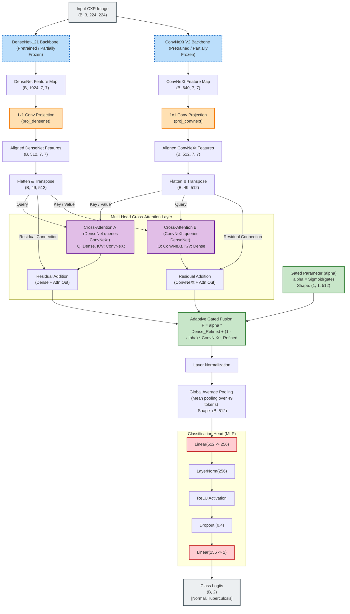

# Tuberculosis (TB) Detection Hybrid Model Architecture

This document describes the design and flow of the hybrid deep learning model used for Tuberculosis detection on Chest X-Rays. The model leverages two strong feature extractors: **DenseNet121** (efficient feature reuse and gradient flow) and **ConvNeXt V2** (modern convolutional architecture with sparse convolutions and GRN).

## Architecture Flow Diagram

---

## Detailed Step-by-Step Architecture Breakdown

### 1. Dual Feature Extraction (Backbones)
We use two complementary backbones to extract spatial features from the input Chest X-ray images of size `(B, 3, 224, 224)`:
* **DenseNet121 Backbone ([densenet.py](file:///d:/TB/Final/models/densenet.py))**: Extracts feature map of shape `(B, 1024, 7, 7)`. DenseNet utilizes dense connections where each layer obtains inputs from all preceding layers, making it highly effective at preserving low-level details.
* **ConvNeXt V2 Backbone ([convnext.py](file:///d:/TB/Final/models/convnext.py))**: Extracts feature map of shape `(B, 640, 7, 7)`. ConvNeXt V2 uses modern convolutional design blocks inspired by Transformers (e.g. depthwise convolutions, LayerNorm, and GELU).

### 2. Channel Alignment (Linear Projections)
Since the feature channel dimensions of the two backbones do not match (`1024` for DenseNet and `640` for ConvNeXt), we project both to a common projection dimension (`projection_dim = 512`):
* `proj_densenet`: A `1x1` 2D Convolution mapping channels from `1024 -> 512`.
* `proj_convnext`: A `1x1` 2D Convolution mapping channels from `640 -> 512`.

### 3. Spatial Tokenization
The projected features are flattened from `(B, 512, 7, 7)` to `(B, 512, 49)` and transposed to `(B, 49, 512)`. This transforms the 2D spatial dimensions into 49 spatial "tokens," matching the sequence-style input expected by PyTorch's Multihead Attention module.

### 4. Bidirectional Cross-Attention
We use two independent Multi-Head Cross-Attention modules (`num_heads = 4`, `dropout = 0.4`) to let the two models share their complementary representations:
* **Cross-Attention A (DenseNet queries ConvNeXt)**: DenseNet features act as Queries ($Q$), while ConvNeXt features act as Keys ($K$) and Values ($V$). This refines DenseNet features by attending to contextual regions highlighted by ConvNeXt.
* **Cross-Attention B (ConvNeXt queries DenseNet)**: ConvNeXt features act as Queries ($Q$), while DenseNet features act as Keys ($K$) and Values ($V$). This refines ConvNeXt features by attending to context highlighted by DenseNet.

*Residual connections* are applied to preserve original branch features:
$$\text{Refined DenseNet} = \text{DenseNet} + \text{CrossAttention}_A(\text{DenseNet}, \text{ConvNeXt})$$
$$\text{Refined ConvNeXt} = \text{ConvNeXt} + \text{CrossAttention}_B(\text{ConvNeXt}, \text{DenseNet})$$

### 5. Learnable Adaptive Gated Fusion
Instead of simple concatenation or addition, we fuse the refined features using a learnable gating parameter (`self.gate` of shape `(1, 1, 512)` initialized to zero):
$$\alpha = \text{Sigmoid}(\text{gate})$$
$$\text{Fused Features} = \alpha \times \text{Refined DenseNet} + (1 - \alpha) \times \text{Refined ConvNeXt}$$

Since $\alpha$ is a vector of size 512, the model learns a **channel-wise gate** that decides how much information to retain from each branch dynamically.

### 6. Pooling & Normalization
* A **Layer Normalization** (`self.ln`) is applied to stabilize feature distributions.
* A **Global Average Pooling** layer averages the 49 spatial tokens along the sequence dimension to generate a single feature vector of shape `(B, 512)`.

### 7. Classification Head (MLP)
The fused feature vector is passed to a Multi-Layer Perceptron (MLP) for final diagnosis:
1. `Linear(512 -> 256)`
2. `LayerNorm(256)`
3. `ReLU` Activation
4. `Dropout(p=0.4)` (regularization to prevent overfitting)
5. `Linear(256 -> 2)` (outputs logits for [Normal, Tuberculosis] classification)
